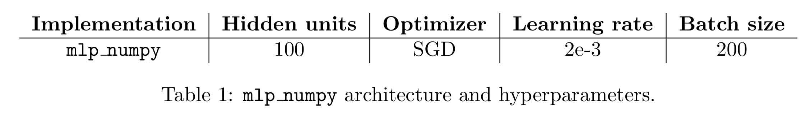
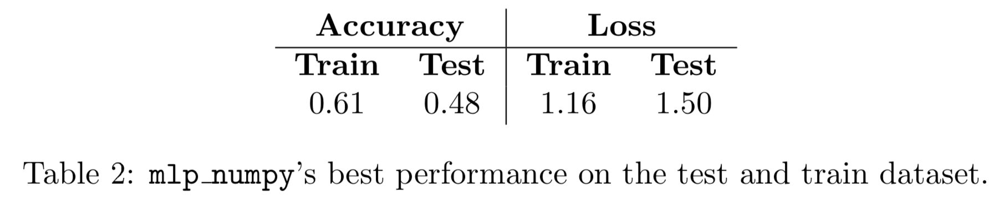
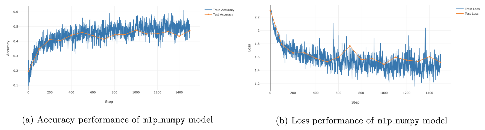
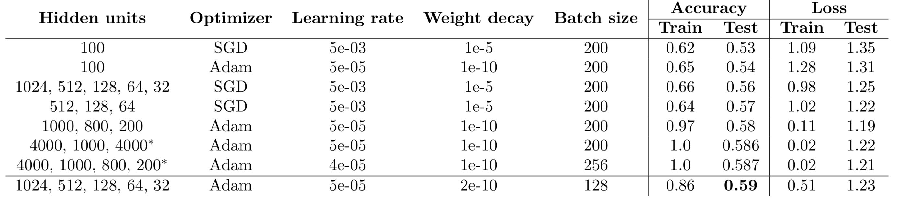
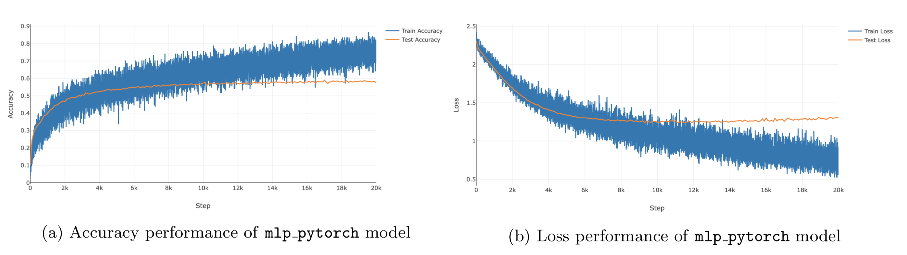
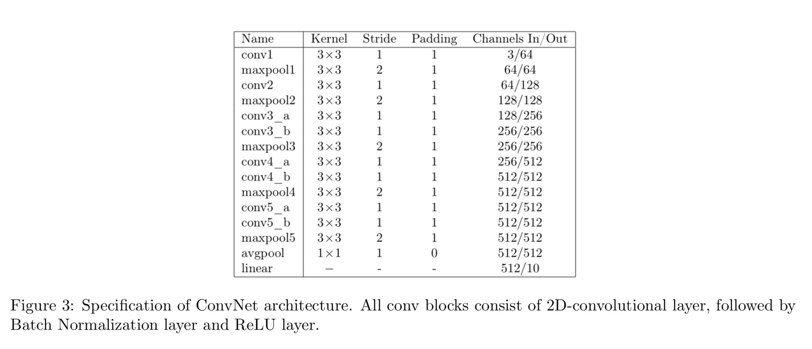
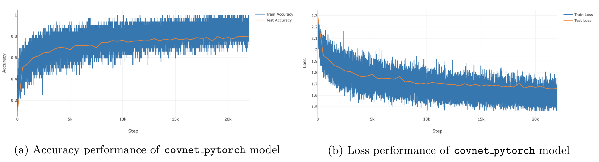
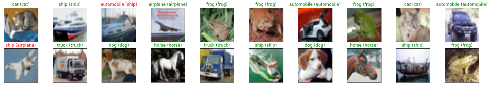

#  Multi-Layer Percepton and Convolution Neural Networks

  

    CIFAR dataset.

## Description
We fist focus on implimenting a Neural Network from scatch: implimented with numpy. In this way, we gain in-depth understanding of backpropagation. Then, using pytorch, we tackle an image classification task on <a href="https://www.cs.toronto.edu/~kriz/cifar.html">CIFAR-10 dataset</a>  with two neural network architectures: multi-layer perceptrons (__MLP__) and convolutional neural networks (__CNN__).

## MLP from Scatch: implimented with numpy.

  
  
  

    MLP with numpy.

## MLP with pytorch: explore the power of fully connected networks

  
  

    MLP with pytorch.

## CNN: the king of image proccessing

  
  

    CNN with pytorch.

  

    Some results from classification task on CIFAR datasets using CNNs.

###### _Acknowledgement - References_

_The majority of the projects come from the lab assignments of the [Deep Learning](deeplearningamsterdam.github.io) course of the MSc in Artificial Intelligence at the University of Amsterdam._
