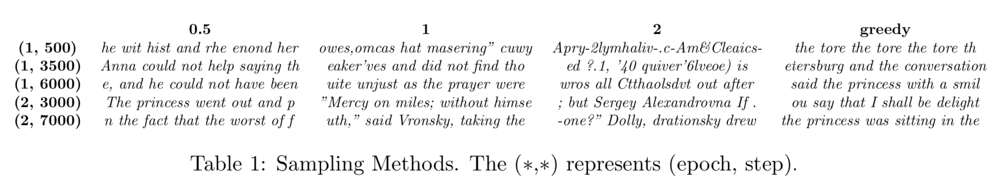
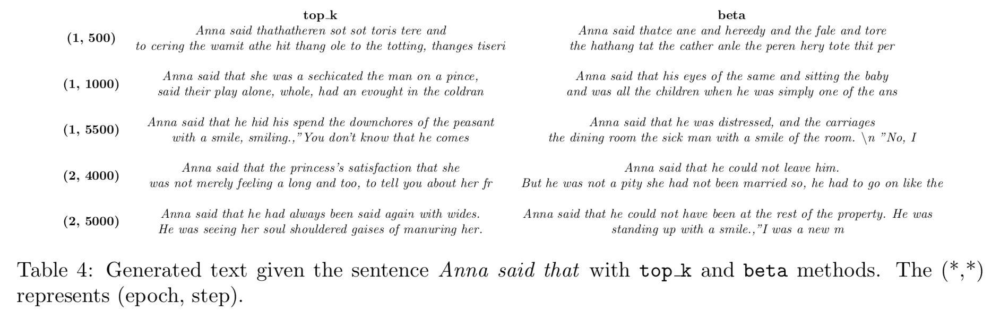

# Recurrent Neural Networks

  

<!-- 

    Generate text with LSTM.

 -->

## Description
Recurrent Neural Networks (__RNN__) vs Long Short-Term Networks (__LSTM__); how they differ in modelling long-term dependencies?

After we train a LSTM network in a book, we raised the bar and _generate text_ from it with various of sampling techniques. We used Leo Tolstoys' _Anna Karenina_ book.

  

    LSTM.

Some samples of generated text. For more details, please see the report.

  
  

###### _Acknowledgement - References_

_The majority of the projects come from the lab assignments of the [Deep Learning](deeplearningamsterdam.github.io) course of the MSc in Artificial Intelligence at the University of Amsterdam._