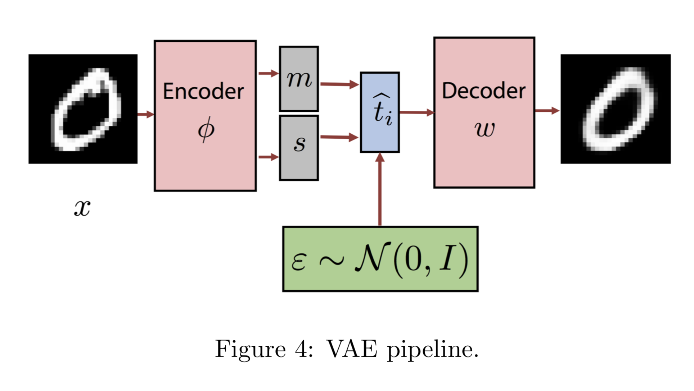
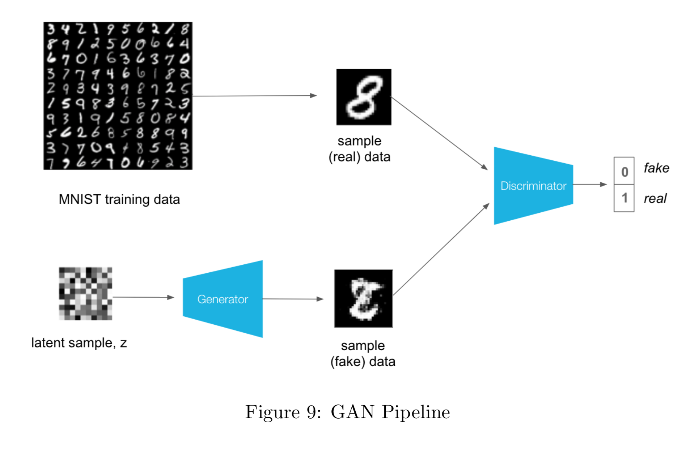
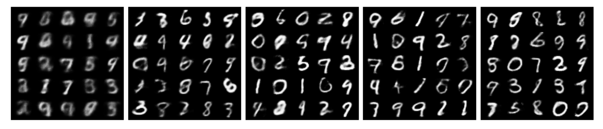
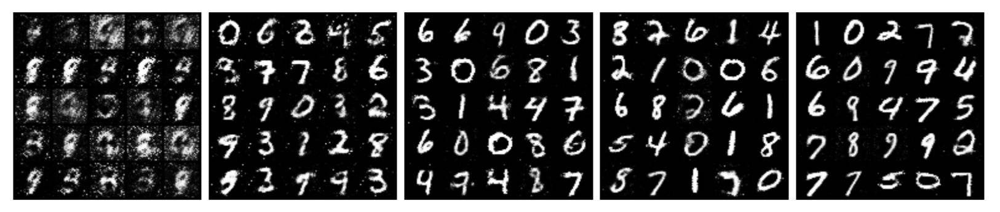
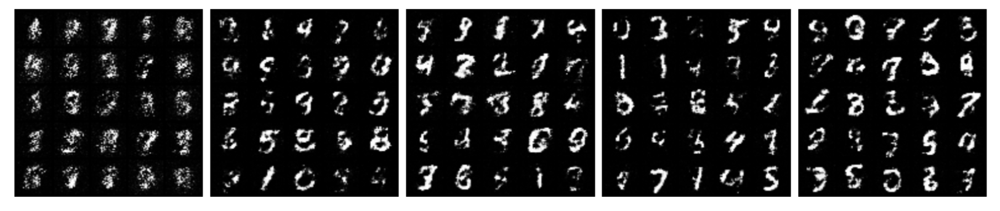
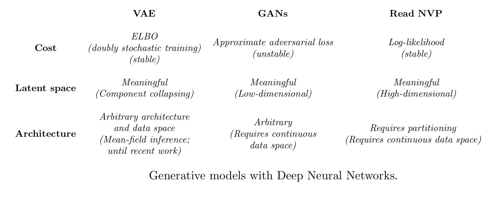

# Generative Models

  

<!-- 

    Generate text with LSTM.

 -->

## Description
We studied and implemented three of the most famous and powerful generative models, namely __Variational Auto Encoders__ (VAEs), __Generative Adversarial Networks__ (GANs) and __Generative Normalizing Flows__ (NFs). We analyzed both from theoretical and practical spectrum, we presented their mathematical framework and results for practical implementations.

- [Assignment](3-Generative_models/assignment_3.pdf), [report](3-Generative_models/gatopoulos_report_assignment3.pdf) and [code](3-Generative_models/code)

## VAEs

  

A VAE is a latent variable model that leverages the flexibility of Neural Networks (NN) in order to learn/specify a latent variable model.

  

    VAE manifold.

## GANs

  

Generative Adversarial Networks (GAN) are a type of deep generative models. Similar to VAEs, GANs can generate images that mimick images from the dataset by sampling an encoding from a noise distribution. In constract to VAEs, in vanilla GANs there is no inference mechanism to determine an encoding or latent vector that corresponds to a given data point (or image).

  

    GAN training progress.

## NFs

  

    NF pipeline.

Similar to VAEs, Flow-based generative models have a distribution over the latent variables. Unlike VAEs, there is an exact correspondence (not a distribution) between a single datapoint and a latent representation.

## COMPARISON

  
  
  

    From the top to the bottom, VAE, GAN and NF on the 1, 10, 20, 30 and 40 epoch the first and the last, and on the 1, 12 50 110 and 200 epoch for the GAN.

The following table sums up the most important consepts of this models.

  

###### _Acknowledgement - References_

_The majority of the projects come from the lab assignments of the [Deep Learning](deeplearningamsterdam.github.io) course of the MSc in Artificial Intelligence at the University of Amsterdam._