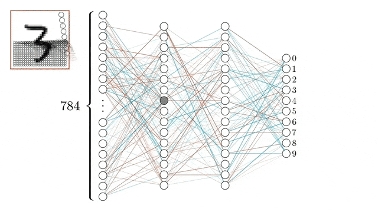
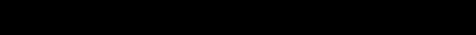

# Deep Learning

## Description
Welcome to my __Deep Learning__ reposetory! Here you will find various projects from fully-connected neural networks, recurrent to generative models!

### __1 - Multi-Layer Percepton and Convolution Neural Networks__

  

    Convolution Neural Networks.

We fist focus on implimenting a Neural Network from scatch: implimented with numpy. In this way, we gain in-depth understanding of backpropagation. Then, using pytorch, we tackle an image classification task on <a href="https://www.cs.toronto.edu/~kriz/cifar.html">CIFAR-10 dataset</a>  with two neural network architectures: multi-layer perceptrons (__MLP__) and convolutional neural networks (__CNN__).

- [Assignment](1-MLP_and_CNN/assignment_1.pdf), [report](1-MLP_and_CNN/gatopoulos_report_assignment1.pdf) and [code](1-MLP_and_CNN/code)

### __2 - Recurrent Neural Networks__

  

    Actual text that generated with LSTM which was trained on Leo Tolstoys' Anna Karenina book.

Recurrent Neural Networks (__RNN__) vs Long Short-Term Networks (__LSTM__); how they differ in modelling long-term dependencies?

After we train a LSTM network in a book, we raised the bar and _generate text_ from it with various of sampling techniques. We used Leo Tolstoys' _Anna Karenina_ book.

- [Assignment](2-RNNs/assignment_2.pdf), [report](2-RNNs/gatopoulos_report_assignment2.pdf) and code for [part1](2-RNNs/part1) and [part2](2-RNNs/part2)

### __3 - Generative Models__

  

    Digits generation via GAN.

We studied and implemented three of the most famous and powerful generative models, namely __Variational Auto Encoders__ (VAEs), __Generative Adversarial Networks__ (GANs) and __Generative Normalizing Flows__ (NFs). We analyzed both from theoretical and practical spectrum, we presented their mathematical framework and results for practical implementations.

- [Assignment](3-Generative_models/assignment_3.pdf), [report](3-Generative_models/gatopoulos_report_assignment3.pdf) and [code](3-Generative_models/code) 

###### _Acknowledgement - References_

_The majority of the projects come from the lab assignments of the [Deep Learning](deeplearningamsterdam.github.io) course of the MSc in Artificial Intelligence at the University of Amsterdam._
